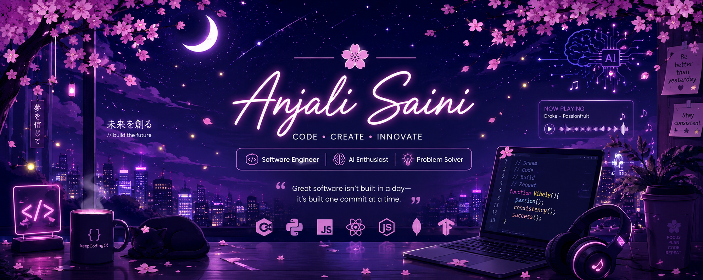

  

# 🌸 Hi, I'm Anjali Saini 👋

*"Dream. Code. Build. Repeat."* ✨

---

# 🌙 About Me

I'm a **Computer Science Engineering** student passionate about building impactful software that blends **Artificial Intelligence, Data Science, and Full Stack Development**.

I enjoy transforming ideas into scalable products while continuously exploring modern technologies, problem solving, and intelligent software solutions.

### 🌸 Current Focus

- 💻 Full Stack Development
- 🤖 Artificial Intelligence & Machine Learning
- 📊 Data Science & Analytics
- 🚀 Solving LeetCode consistently
- 🌐 Open Source Contributions
- 🎵 Building **Vibely** — an AI-powered music platform with an anime-inspired UI

---

# ⚡ Tech Stack

---

# 🚀 Featured Projects

## 🎵 Vibely

> AI-powered music streaming platform featuring:

- 🎧 AI DJ
- 🌸 Anime-inspired dark UI
- 👥 Real-time listening with friends
- 📂 Playlist management
- 🌙 Moon, stars & sakura aesthetics
- ✨ Firefly animations

---

## 📊 Data Science Projects

- Data Analysis
- Machine Learning
- Data Visualization
- Predictive Analytics
- Python • Pandas • NumPy

---

## 🤖 Artificial Intelligence

Currently exploring

- Machine Learning
- Neural Networks
- Vector Search
- Intelligent Applications

---

# 💻 LeetCode

---

# 📈 GitHub Analytics

---

# 🏆 GitHub Achievements

---

# 📊 Contribution Activity

---

# 🎧 Currently Coding To

- 🎵 Drake
- 🎼 Lo-fi
- 🌸 Anime OSTs
- 🌌 Synthwave

---

# 🌱 Currently Learning

- Advanced Data Structures & Algorithms
- System Design
- Machine Learning
- Deep Learning
- Generative AI
- Cloud Computing

---

# 🤝 Open To

- 💼 Software Engineering Internships
- 🤖 AI / ML Internships
- 📊 Data Science Opportunities
- 🌍 Open Source Contributions
- 🏆 Hackathons
- 🔬 Research Collaborations

---

# 📫 Connect With Me

---

### 🌸 "Consistency today creates opportunities tomorrow."

⭐ Thanks for visiting my profile!

